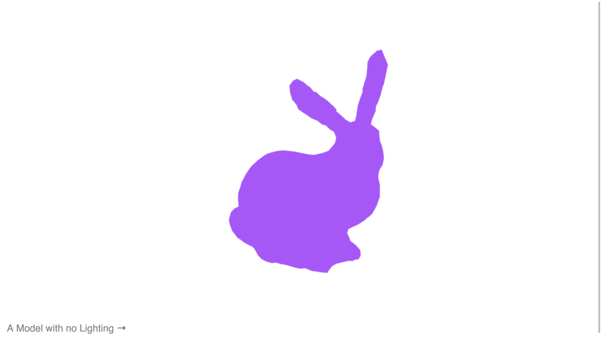
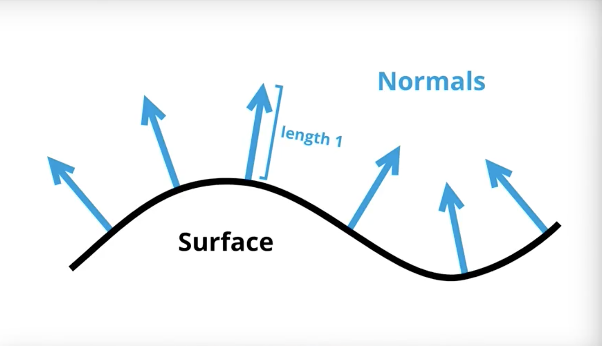
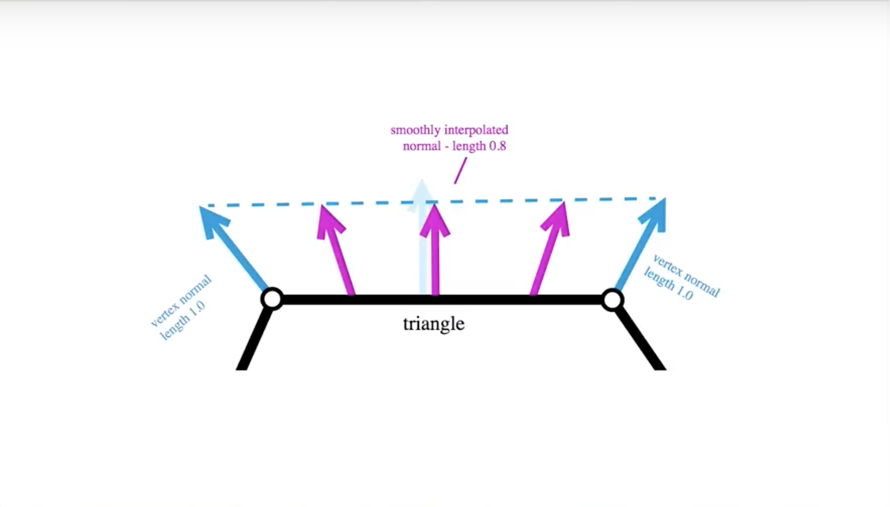
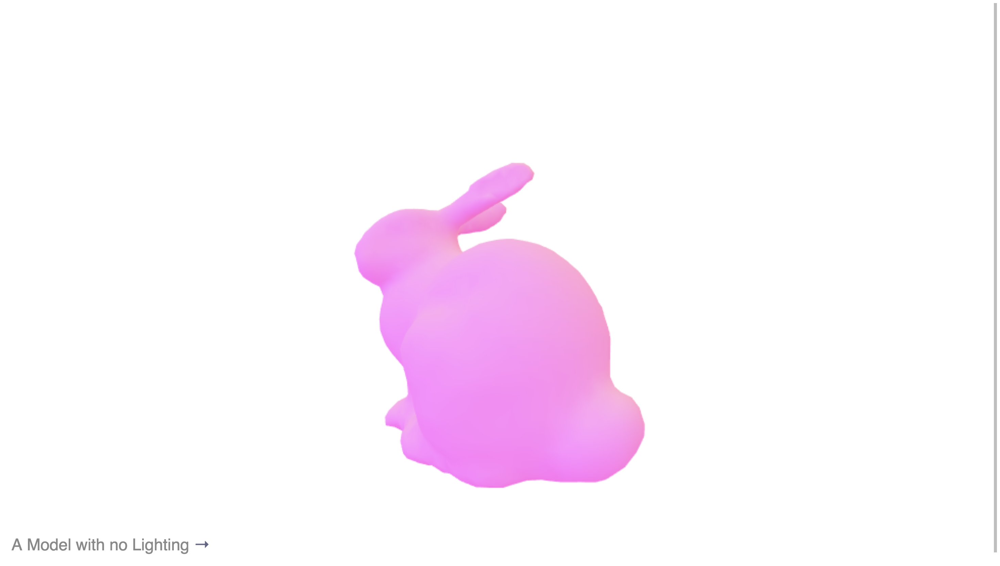
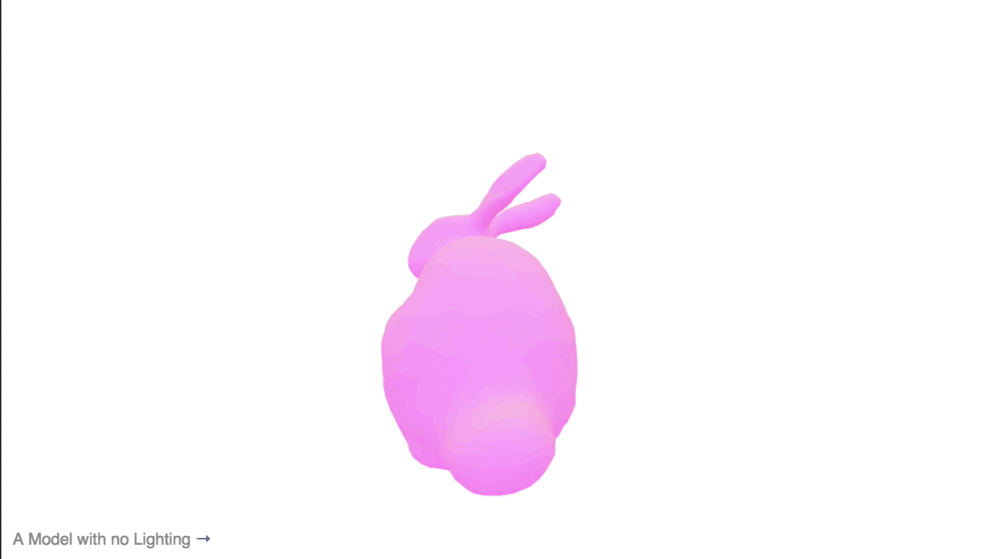

# Lighting

## Flat Shading

WebGL lighting leverages a lot of math under the hood, so it's really helpful to have some basic knowledge of matrix math and model, view, and projection matrices. It's not absolutely necessary, but it's very useful.

Lighting is the process of taking model data and simulating the effects of photons hitting the surface. Generally for real time graphics the approach has been to fake it, rather than trying to accurately recreate the physics of lighting models. Newer approaches can take a more realistic approach, while these lessons deal with more traditional (fake) models of simulating light.

Exercises:

* Modify the color to play with the basic projected image.

* Use a varying value in the shader to pass the position down to the fragment shader. Use the position to drive some part of the color, for example the depth.

From a high level, the main script does WebGL work from scratch with the help of some helper libraries. Our program creates the program, the buffers, locations, stores the matrix transforms, and has some internal state for the color. It computes the projection matrix, the view matrix and then invokes the draw loop.

The draw call computes the model matrix and updates all attributes and uniforms and then finally draws the elements, which it draws as `gl.TRIANGLES` with the bunny model that we have. It then fires a `requestAnimationFrame` which then sets off the loop.

What's important here is the shader code. We want to give our model some color as a first step. We accomplish this by changing the `gl_fragColor` variable and giving it any 4-dimensional vector of our choice:

```glsl
precision mediump float;

// The color of the model
uniform vec4 color;

void main() {
  // We can either pass in a color as a uniform
  // or define a vector from scratch!
  gl_FragColor = vec4(0.7, 0.3, 1.0, 1.0);
}
```



Right now, our model is flat. There's no lighting information there, so there's no way to really differentiate parts of the surface to give our model some sort of shading to make it look like somewhat of a realistic object. This is where normals come in.

## Surface Normals

We've gone over how we can set a base color for a model so we can draw it to a screen, but what we really care about is how the surface of the model can behave as if light is shining on it. We can describe the surface of a model by using normals. Before, all we were doing was moving the bunny into the scene and assigning a color to it. What we really need to do is find a way to describe the surface of the model, and we do that through a surface normal.

Normals are extremely useful for working with lighting. A surface can be defined as a plane at its core (may be wavy or straight). But if we just place a point on this plane, we don't really know how that plane is changing over time. What we need to do is create a vector that is length 1, and point perpendicular to the surface (outwards). As illustrated in the graphic, we can see that as the surface curves, the normal is pointing perpendicular at any given point. This tells us very quickly which direction the surface is pointing in.



In our WebGL program, we've got a buffer for our position of the model, and all the triangles that make up the model. Normals are length 1 and made up of `x`, `y` and `z` values. Examining the `createBuffers` function, we can see that we've allocated a buffer for holding data about our normals (that was provided for us with the bunny model).

Looking at the vertex shader in `index.html`, we've declared the attribute `normal` of the vertex to be available to us. We then declare a `varying vNormal` which gets assigned the `normal` attribute and pass that value down to the fragment shader from the vertex shader. Our fragment shader goes from returning a solid color to returning a color value the is an operation on our normal value:

```glsl
precision mediump float;

// The color of the model
uniform vec4 color;

varying vec3 vNormal;

void main() {
  // Normals are ranged -1 to 1. Transform it to 0 and 1.
  vec3 adjustedNormal = normalize(vNormal) * 0.5 + 0.5;

  gl_FragColor = vec4((color.xyz * 1.0 + adjustedNormal * 0.3) , 1.0);
}
```

Something happens to our normal during this operation. We can see that we've got an interpolated normal value between the two vertices that the normal is defined on.



To mitigate this, we need to always be sure that we're running the `normalize()` function provided by GLSL, and adjusting it for our usage. Our model now looks like it's truly lit!



There is a crucial flaw here. The normals of this model are changing with the camera as the model is rotating. This is bad for lighting because the lighting is fixed to the camera. We need to transform these normals in order to anchor them.

## Normal Matrix

Before, we were able to use the surface normals to give us some information about how the surface of the model is behaving. But now we need to use that in a more mathematically rigorous manner so it stays put where we put it. That way, it behaves with the rest of the matrices that we're using.

At this point, we've got a function `computeModelMatrix()`, which handles the rotation of the model. We need a new function to compute the normal matrix. Our `computerNormalMatrix()` function takes the modelView matrix which it gets by combining the model matrix and the camera matrix, and uses that to transform the normals.

A normal is of length 1, so taking a translation matrix and naively applying it will result in our normals zooming off the screen with arbitrary length. The correct matrix that we need is the inverse transposed 3x3 matrix of a 4x4 matrix. Well, okay. We don't need to do that. Someone has already done the gnarly math for us. We just need our normals to be transformed in the same way that the model and the camera is being transformed. Note that this does not account for the projection matrix!

Basically, take a 4x4, run it through the normalMatrix function, and you get the magical matrix you can feed through. In code, this is our vertex shader now:

```glsl
attribute vec3 position;
attribute vec3 normal;
uniform mat4 model;
uniform mat4 view;

uniform mat4 projection;
uniform mat3 normalMatrix

varying vec3 vNormal;

void main() {
  // Note that we're applying the matrix in the vertex shader, because we want the operation to be per vertex
  vNormal = normalMatrix * normal;
  gl_Position = projection * view * model * vec4( position, 1.0 );
}
```



Our lighting is now fixed to the model and we have a consistent way of describing the model's surface regardless of camera transformations.
